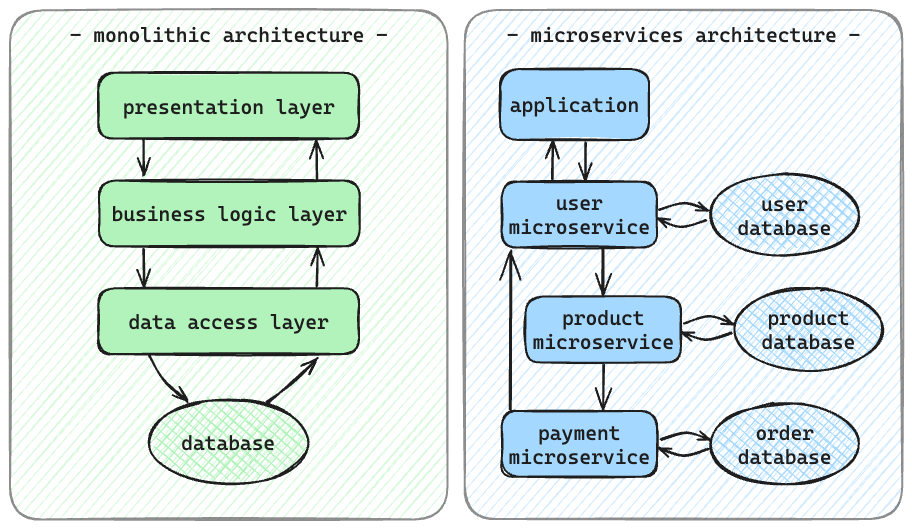

# Software Architectural Patterns
## Monolithic Architecture

The monolithic architecture is a traditional software design approach where the entire application is built as a single, tightly-coupled unit that uses a single database, with interdependent components and modules being interconnected.

### Pros

- *Simplicity*

  Relatively easy to develop, test and understand, especially for small to medium-sized applications
- *Single Codebase*

  Maintenance is simple as there is only one codebase to manage, build and deploy
- *Easy to Debug*

  Debugging is straightforward as the entire application is in one codebase
- *Performance*

  More efficient in certain cases due to direct method calls and shared memory

### Cons

- *Scalability* 

  Scaling can be challenging as the entire application needs to be scaled, even if only a specific module requires more resources
- *Flexibility* 

  Changes and updates may be more challenging, and deploying new features can be cumbersome
- *Tech Stack*

  Limited flexibility in choosing different technologies for different components
- *Fault Tolerance*

  If one part of the monolith fails, the entire system can be affected

### Example Application
A content management system (CMS) for a personal blog or a small e-commerce website

### vs Microservices Architecture

| | Monolithic | Microservices |
|-----|------|-------|
| *Structure* | Single, tightly integrated unit | Decentralised, independent services |
| *Scalability* | Lower - entire application must be scaled | Better - individual services can be scaled independently |
| *Development & Maintenance* | Simpler | More complex - each service can be developed and maintained independently |
| *Tech Stack Flexibility* | Limited | High |
| *Fault Tolerance* | Low - entire system affected if one part fails | High - entire system not always impacted by failure in one service |

